# AGENTGUARD — COMPLETE MASTER SYSTEM FLOW & OPERATIONAL SPECIFICATION

> **Authoritative Master Target Architecture & Operational Specification**  
> **Repository:** `d:\AGENTGUARD`  
> **Document Purpose:** Single comprehensive end-to-end architectural, functional, and security reference model for developers, operators, security analysts, and administrators building and integrating the AGENTGUARD runtime control plane.

---

## TABLE OF CONTENTS

1. [System High-Level Architecture](#1-system-high-level-architecture)
2. [Actors & Actor Taxonomy](#2-actors--actor-taxonomy)
3. [Enterprise Role Hierarchy & Governance Tiers](#3-enterprise-role-hierarchy--governance-tiers)
4. [Master Role × Function × CRUD Permission Matrix](#4-master-role--function--crud-permission-matrix)
5. [AI Agent Lifecycle State Machine](#5-ai-agent-lifecycle-state-machine)
6. [Agent Passport & Cryptographic Identity](#6-agent-passport--cryptographic-identity)
7. [Permissions vs. Dynamic Capabilities](#7-permissions-vs-dynamic-capabilities)
8. [Central Runtime Governance Loop (The 18-Stage Kernel)](#8-central-runtime-governance-loop-the-18-stage-kernel)
9. [Intent Extraction & Context Engineering](#9-intent-extraction--context-engineering)
10. [Risk Scoring & Dynamic Anomaly Calculation](#10-risk-scoring--dynamic-anomaly-calculation)
11. [Policy Engine & Deterministic Conflict Precedence](#11-policy-engine--deterministic-conflict-precedence)
12. [Human Approval & Escalation Workflow](#12-human-approval--escalation-workflow)
13. [Execution Control & Tool Proxy Gateway](#13-execution-control--tool-proxy-gateway)
14. [Runtime Telemetry & FinOps Cost Accounting](#14-runtime-telemetry--finops-cost-accounting)
15. [Immutable Audit Logging & Provenance Graph](#15-immutable-audit-logging--provenance-graph)
16. [Security Operations Center (SOC) & Threat Incident Lifecycle](#16-security-operations-center-soc--threat-incident-lifecycle)
17. [Internal Red Team Lab & Adversarial Fuzzing](#17-internal-red-team-lab--adversarial-fuzzing)
18. [Digital Twin Sandboxed Stress Simulation](#18-digital-twin-sandboxed-stress-simulation)
19. [AI Model Governance & Dynamic Routing](#19-ai-model-governance--dynamic-routing)
20. [AI Output Governance & Guardrails](#20-ai-output-governance--guardrails)
21. [AI Admin Assistant Architecture](#21-ai-admin-assistant-architecture)
22. [Notification & SSRF-Protected Webhook Infrastructure](#22-notification--ssrf-protected-webhook-infrastructure)
23. [Background Workers, Celery Beat & Queue Topology](#23-background-workers-celery-beat--queue-topology)
24. [Enterprise Report Generation & Storage Abstraction](#24-enterprise-report-generation--storage-abstraction)
25. [Multi-Tenant Subscription Billing & Quota Enforcement](#25-multi-tenant-subscription-billing--quota-enforcement)
26. [Super Admin Global Platform Operations](#26-super-admin-global-platform-operations)
27. [Actor Interaction Chronology: Who Interacts With What & When](#27-actor-interaction-chronology-who-interacts-with-what--when)

---

## 1. System High-Level Architecture

The core tenet of AGENTGUARD is non-bypassability: **No autonomous AI agent action may ever execute directly against external business resources (databases, payment gateways, APIs, emails, tools) without traversing the centralized runtime governance kernel.**

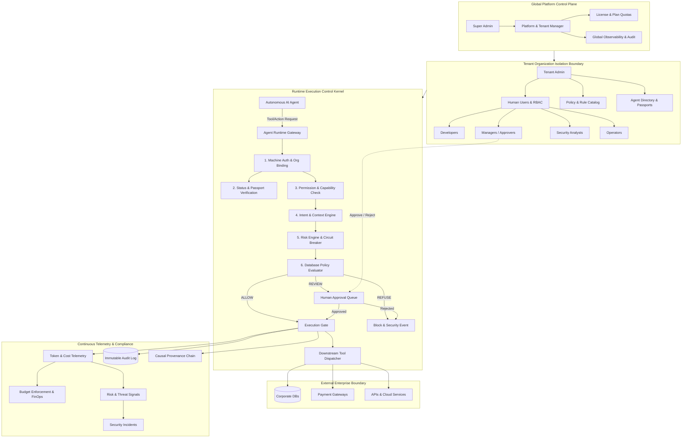

---

## 2. Actors & Actor Taxonomy

AGENTGUARD distinguishes three distinct classes of actors across the system:

### A. Global Platform Actor (`SUPER_ADMIN`)
- **Authority:** Unrestricted cross-tenant oversight and platform infrastructure operations.
- **Scope:** Global. Oversees all tenant organizations, canonical subscription tiers, system-level health, and global compliance audit logs.
- **Isolation Constraint:** Never casually mutates tenant-specific business data; operates through administrative impersonation contexts (`X-Organization-Context`) for auditing and troubleshooting.

### B. Human Organization Users (Tenant Scoped)
Every human belongs strictly to one organization (`org_id`). Tenant isolation is enforced cryptographically at the session and database layer.
1. **`ADMIN`:** Organization owner. Manages tenant configuration, user directory, human roles, API keys, agent creation, and billing.
2. **`DEVELOPER`:** Agent engineer. Registers AI agents, configures runtime capability profiles, tests agent integrations, and monitors debug telemetry.
3. **`MANAGER`:** Operational business owner. Reviews escalated high-risk agent decisions, grants or rejects approval requests, and inspects business impact analytics.
4. **`SECURITY_ANALYST`:** SOC officer. Monitors threat signals, investigates security incidents, triggers automated agent kill-switches, and executes internal red-team simulations.
5. **`OPERATOR`:** Day-to-day controller. Monitors active agent workloads, handles routine operational approvals, and verifies runtime agent health.
6. **`ANALYST`:** Read-only data auditor. Inspects telemetry trends, financial spending velocity, decision distributions, and generates compliance reports.
7. **`VIEWER`:** Executive observer. Read-only dashboard access with zero mutation authority.
8. **`USER`:** Base organizational user with self-service profile access.

### C. Machine Identities (`AGENT`)
An AI Agent is a first-class machine identity. It is **not** a human user and **not** a simple database row.
- **Attributes:** Unique machine code (`AG-xxx`), cryptographic credentials (hashed API keys), signed Agent Passport, autonomy level (`LOW`, `MEDIUM`, `HIGH`, `FULL`), operational status, assigned daily/monthly budgets, granted permissions, and scoped capability tokens.
- **Execution Mandate:** Agents possess zero implicit ambient authority. Every operation is authenticated and verified on every single request.

---

## 3. Enterprise Role Hierarchy & Governance Tiers

AGENTGUARD implements an authoritative 9-level hierarchical human RBAC model alongside dedicated machine roles:

```text
Level 9: SUPER_ADMIN (Platform Control Plane)
   │
Level 8: ADMIN (Tenant Organization Administration)
   │
Level 7: DEVELOPER (Agent Creation, API Keys, Runtime Integrations)
   │
Level 6: MANAGER (Business Governance, Decision Reviews, Approvals)
   │
Level 5: SECURITY_ANALYST (SOC, Incidents, Threat Signals, Kill Switches)
   │
Level 4: OPERATOR (Agent Operations, Routine Approvals, Health)
   │
Level 3: ANALYST (Auditing, Telemetry Analysis, Compliance Reports)
   │
Level 2: VIEWER (Read-Only Tenant Dashboards)
   │
Level 1: USER (Standard Self-Service Human Account)

Machine Identity: AGENT (Autonomous Runtime Identity Governed by Kernel)
```

### Hierarchy Rules
1. **Delegation Ceiling:** A human user can only assign or manage roles strictly below their own numerical level (`can_manage_role(actor_role, target_role)`).
2. **Platform Boundary:** No tenant `ADMIN` can create, assign, or view `SUPER_ADMIN` entities.
3. **Tenant Inviolability:** No user (including `ADMIN`) can access, query, or mutate resources belonging to an `org_id` different from their JWT session claims.

---

## 4. Master Role × Function × CRUD Permission Matrix

| Module / Resource | SUPER_ADMIN | ADMIN | DEVELOPER | MANAGER | SECURITY_ANALYST | OPERATOR | ANALYST | VIEWER | USER | AGENT (Machine) |
|---|---|---|---|---|---|---|---|---|---|---|
| **Organizations** | CRUD + Suspend | RU (Own Org) | R (Own Org) | R (Own Org) | R (Own Org) | R (Own Org) | R (Own Org) | R (Own Org) | R (Own Org) | Bound To Org |
| **Subscription & Plans** | CRUD (All Plans) | R (Own Plan) | R (Own Plan) | R (Own Plan) | — | — | R (Own Plan) | — | — | Subject to Quotas |
| **User Directory** | CRUD (Platform) | CRUD (Tenant) | R (Tenant) | R (Tenant) | R (Tenant) | R (Tenant) | R (Tenant) | R (Tenant) | R (Self) | — |
| **User Invitations** | CRUD | CR (Tenant) | — | — | — | — | — | — | — | — |
| **Human Roles** | Manage All (1-9)| Manage (1-7) | — | — | — | — | — | — | — | Subject to Auth |
| **API Keys (Developer)** | CRUD | CRUD (Tenant) | CRU (Own Keys)| — | R (Audit) | — | — | — | — | Uses Machine Creds |
| **Agent Registration** | CRUD | CRUD | CRUD | R | R (Audit) | R | R | R | — | — |
| **Agent Credentials** | CRUD | CRUD | CRUD | — | R (Audit) | — | — | — | — | Uses for Auth |
| **Agent Passports** | CRUD + Verify | CRUD + Verify | R + Issue | R | R + Audit | R | R | R | — | Presents at Runtime |
| **Agent Permissions** | CRUD | CRUD | CRUD | R | R (Security) | R | R | — | — | Enforced at Gate |
| **Capability Tokens** | CRUD + Revoke | CRUD + Revoke | CR + Revoke | R | R + Revoke | CR + Revoke | R | — | — | Consumed at Gate |
| **Kill Switch / Breaker**| Trip / Reset | Trip / Reset | — | Trip | Trip (Security) | Trip | — | — | — | Tripped if Rogue |
| **Policy Catalog** | CRUD (All) | CRUD (Tenant) | CRU (Tenant) | CRU (Tenant) | R (Security) | R | R | R | — | Evaluated Against |
| **Decisions (Runtime)** | R (All) | R (Tenant) | R (Tenant) | R + Review | R (Tenant) | R (Tenant) | R (Tenant) | R (Tenant) | — | Generates Record |
| **Approval Requests** | Approve/Reject | Approve/Reject | — | Approve/Reject | Approve/Reject | Approve/Reject | R | — | — | Triggers Queue |
| **Risk Scores & Trends** | R (All) | R (Tenant) | R (Tenant) | R (Tenant) | RU (Tenant) | R (Tenant) | R (Tenant) | R (Tenant) | — | Evaluated at Runtime |
| **SOC Incidents** | CRUD | CRUD (Tenant) | — | R | CRUD (Tenant) | CRU (Assigned) | R | — | — | Triggered By Violations |
| **Red Team Lab** | Run / Review | Run (Tenant) | Run (Sandbox) | — | Run (Tenant) | — | — | — | — | Evaluated Target |
| **Digital Twin** | Run / Review | Run (Tenant) | Run (Tenant) | Run (Tenant) | Run (Tenant) | — | Run (Tenant) | — | — | Evaluated Target |
| **Telemetry & FinOps** | R (All) | R (Tenant) | R (Tenant) | R (Tenant) | R (Tenant) | R (Tenant) | R (Tenant) | R (Tenant) | — | Generates Metrics |
| **Audit Logs** | R (Append-Only)| R (Tenant) | R (Own Activity)| R (Tenant) | R (Tenant) | R (Tenant) | R (Tenant) | R (Tenant) | R (Self) | Immutable Entry |
| **Webhooks & Delivery** | CRUD | CRUD (Tenant) | CRUD (Tenant) | — | R (Audit) | — | — | — | — | Dispatched On Event |
| **Reports (PDF/Excel)** | Generate / View| Generate / View| Generate (Tech)| Generate (Biz) | Generate (Sec) | Generate (Ops) | Generate (All) | View Only | — | — |

*Legend: C = Create, R = Read, U = Update, D = Delete/Revoke.*

---

## 5. AI Agent Lifecycle State Machine

An AI agent progresses through distinct lifecycle phases from creation to decommissioning. Transition between states requires appropriate role authority and emits structured audit logs.

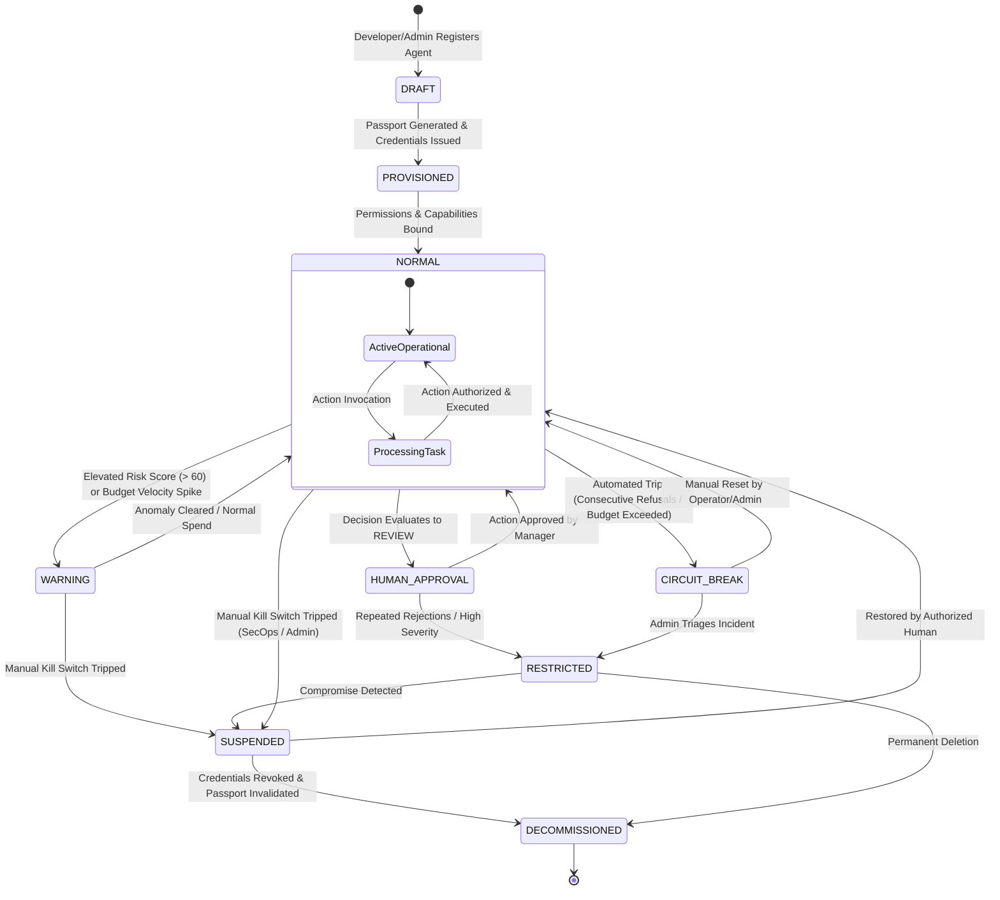

### Lifecycle Transition Controls
1. **Creation:** Initiated by `ADMIN` or `DEVELOPER`. Enforces organization license capacity (`max_ai_agents`).
2. **Suspension (Kill Switch):** Can be triggered by `SECURITY_ANALYST`, `ADMIN`, `MANAGER`, or `SUPER_ADMIN`. Immediately revokes all outstanding capability tokens and drops agent status to `SUSPENDED`.
3. **Restoration:** Requires explicit `PERM_AGENT_RESUME` privileges; resets circuit breaker state and returns agent to `NORMAL`.
4. **Decommissioning:** Irrevocably destroys active credentials, flags passport as `REVOKED`, and preserves historical executions for compliance.

---

## 6. Agent Passport & Cryptographic Identity

The **Agent Passport** is the machine-readable digital identity card representing an agent within AGENTGUARD:

```text
┌────────────────────────────────────────────────────────────────────────┐
│                      AGENTGUARD AGENT PASSPORT                         │
├────────────────────────────────────────────────────────────────────────┤
│ Passport ID:        AG-PASS-839201-9921                                │
│ Agent Code:         AG-FIN-104 (Procurement Agent)                     │
│ Organization ID:    org_92018471-a4b2-4d11-8012-749102847102           │
│ Human Owner:        Sarah Chen (Head of Finance, user_0918)            │
│ Deployment Env:     PRODUCTION                                         │
│ Model Identity:     claude-3-5-sonnet-20241022 (Provider: Anthropic)   │
│ Autonomy Level:     MEDIUM (Requires human approval on amounts > ₹25K) │
│ Issue Date:         2026-10-01T00:00:00Z                               │
│ Expiry Date:        2027-10-01T00:00:00Z                               │
│ Status:             VERIFIED                                           │
├────────────────────────────────────────────────────────────────────────┤
│ Allowed Capabilities:                                                  │
│   • invoice:read                                                       │
│   • vendor:verify                                                      │
│   • payment:create_draft                                               │
├────────────────────────────────────────────────────────────────────────┤
│ Cryptographic Signature:                                               │
│   ed25519:7f83a910bc4928de...[control-plane root signed]               │
└────────────────────────────────────────────────────────────────────────┘
```

### Verification Pipeline
1. **Signature Integrity:** Verified using the AGENTGUARD Control Plane asymmetric public key.
2. **Expiration Enforcement:** Passports past `expires_at` are rejected with HTTP 401.
3. **Revocation Check:** The runtime kernel performs an O(1) lookup on passport revocation state before evaluating actions.

---

## 7. Permissions vs. Dynamic Capabilities

AGENTGUARD enforces a crucial distinction between **Static Permissions** and **Dynamic Capability Tokens**:

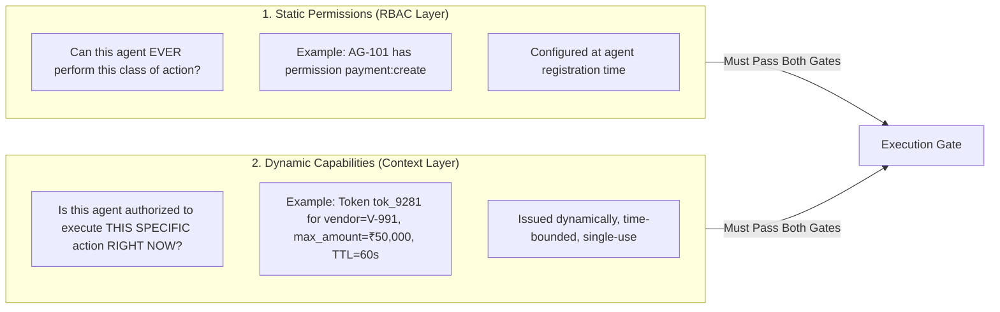

| Dimension | Static Permission (`models.Permission`) | Dynamic Capability (`models.CapabilityToken`) |
|---|---|---|
| **Question Answered** | *Is this category of action allowed in principle?* | *Is this exact action authorized in this specific context?* |
| **Granularity** | Coarse-grained (`DATABASE:READ`, `TOOL:EXECUTE`) | Hyper-fine-grained (`refund:create`, `customer_id=991`) |
| **Duration** | Permanent until administratively modified | Ephemeral (TTL 60s to 1 hour) |
| **Monetary Caps** | None | Explicit maximum amount limits |
| **Consumption** | Reusable across requests | Atomically marked `USED` after execution |

---

## 8. Central Runtime Governance Loop (The 18-Stage Kernel)

Every agent action request must traverse this exact sequential pipeline. If any stage rejects, execution immediately terminates and enters the audit trail.

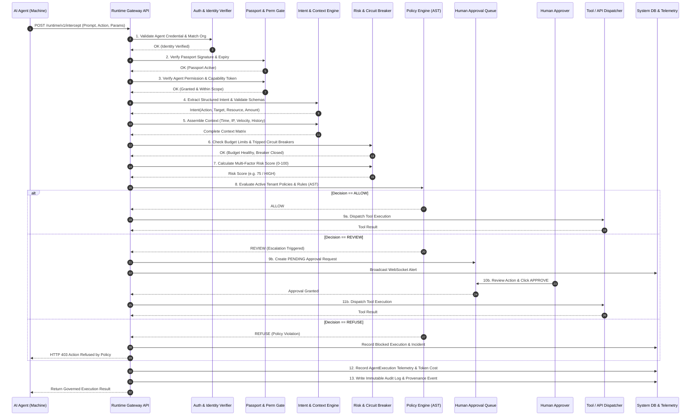

---

## 9. Intent Extraction & Context Engineering

The runtime kernel translates raw agent prompts or tool calls into unambiguous, strongly-typed governance intents before evaluating policies.

```text
Raw Agent Request:
"Disburse vendor refund of ₹45,000 to customer account CUST-9921 for order #88192"
                       │
                       ▼
         [ Intent Extraction Engine ]
                       │
                       ▼
Structured Governance Intent:
{
  "action": "refund:create",
  "resource": "payment_gateway.refunds",
  "target_entity": "CUST-9921",
  "amount": 45000.00,
  "currency": "INR",
  "parameters": {
    "order_id": "88192",
    "reason": "customer_return"
  }
}
                       │
                       ▼
          [ Context Engineering Engine ]
                       │
                       ▼
Unified Decision Context:
{
  "intent": "refund:create",
  "amount": 45000.00,
  "resource": "payment_gateway.refunds",
  "agent_id": "ag_99120",
  "agent_code": "AG-101",
  "agent_department": "CustomerSupport",
  "agent_autonomy": "MEDIUM",
  "agent_status": "NORMAL",
  "risk_score": 72,
  "daily_spend_so_far": 12000.00,
  "daily_budget_cap": 50000.00,
  "current_time_utc": "2026-10-01T14:32:00Z",
  "is_operating_hours": true,
  "consecutive_failures": 0
}
```

---

## 10. Risk Scoring & Dynamic Anomaly Calculation

The risk engine computes a bounded compound risk score between `0` and `100`:

$$\text{Composite Risk} = \text{Identity Risk} + \text{Permission Risk} + \text{Financial Velocity Risk} + \text{Behavioral Deviation} + \text{Data Sensitivity}$$

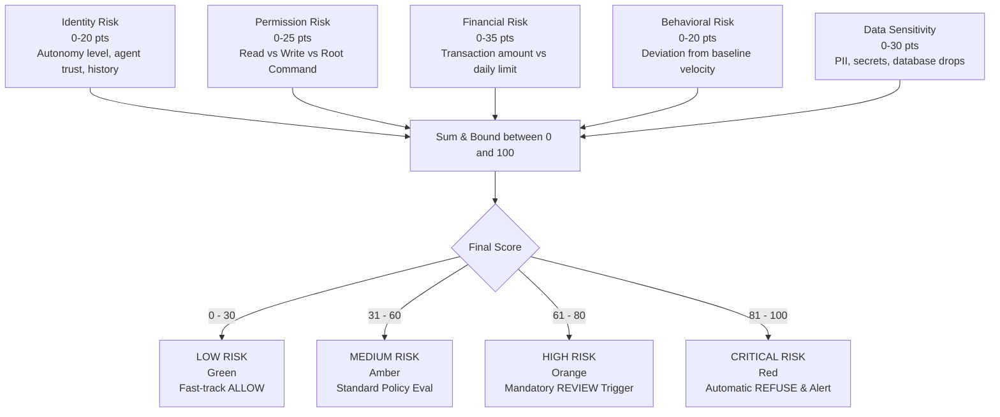

---

## 11. Policy Engine & Deterministic Conflict Precedence

When multiple policy rules match an incoming request context, AGENTGUARD applies the **Strict Conflict Resolution Axiom**:

$$\mathbf{REFUSE} \succ \mathbf{REVIEW} \succ \mathbf{ALLOW}$$

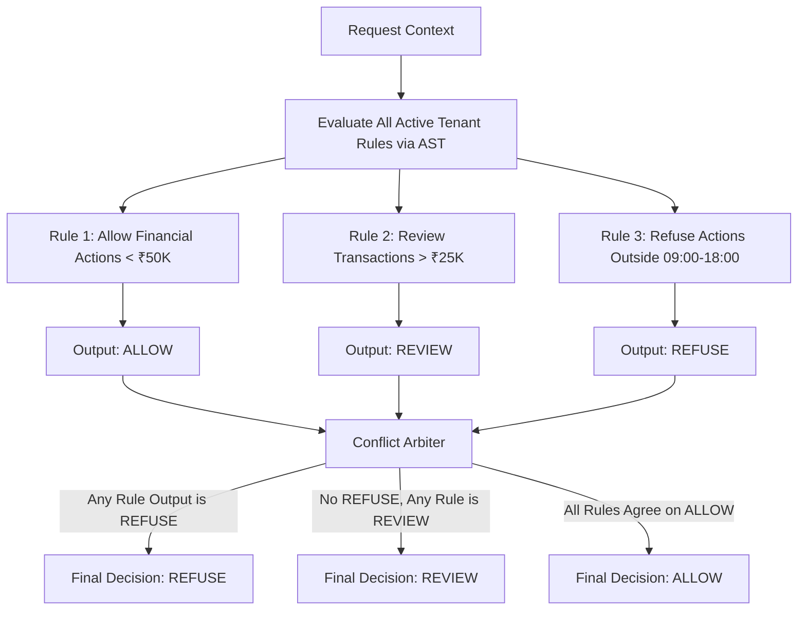

### Safety Rules
1. **No Python `eval()`:** All boolean expressions are validated via Abstract Syntax Tree (`ast.parse`) with strict node allowlists.
2. **Circuit Breaker Override:** If agent state is `SUSPENDED` or `CIRCUIT_BREAK`, the engine emits an immediate `REFUSE` without evaluating database rules.

---

## 12. Human Approval & Escalation Workflow

When an action evaluates to `REVIEW`, execution pauses and passes to the human governance queue:

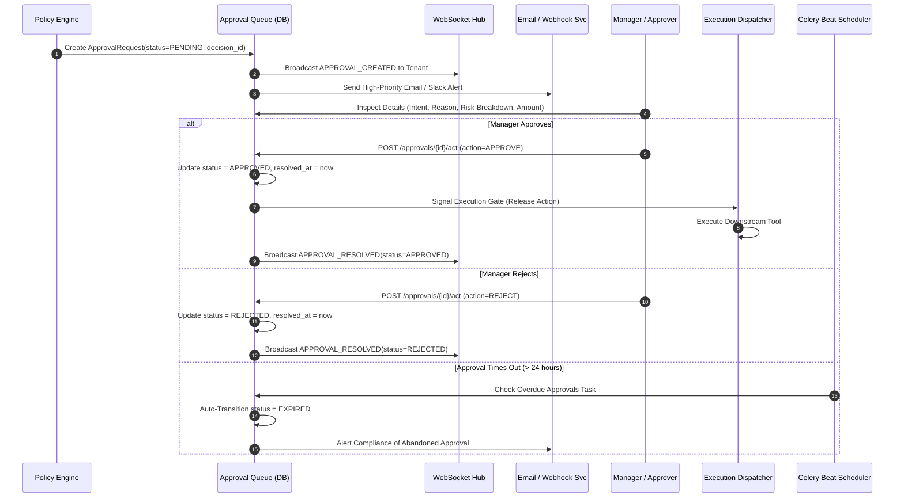

---

## 13. Execution Control & Tool Proxy Gateway

AGENTGUARD acts as the secure intermediary between the agent runtime and external systems:

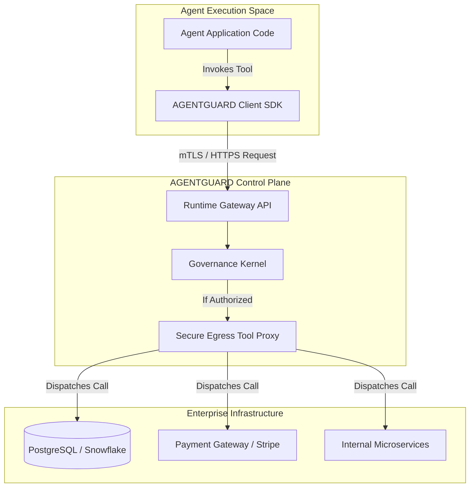

---

## 14. Runtime Telemetry & FinOps Cost Accounting

Every executed or blocked action records deterministic telemetry for token usage, latency, and cost calculations:

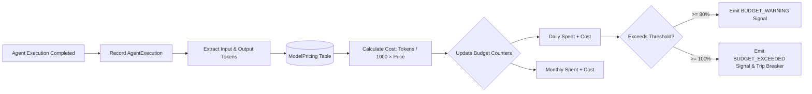

---

## 15. Immutable Audit Logging & Provenance Graph

For every governance decision, AGENTGUARD preserves an **immutable audit record** and reconstructs the full causal chain:

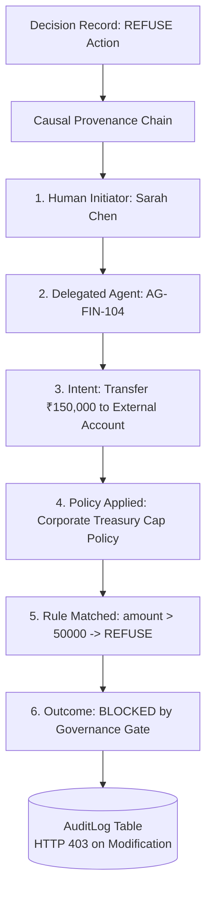

---

## 16. Security Operations Center (SOC) & Threat Incident Lifecycle

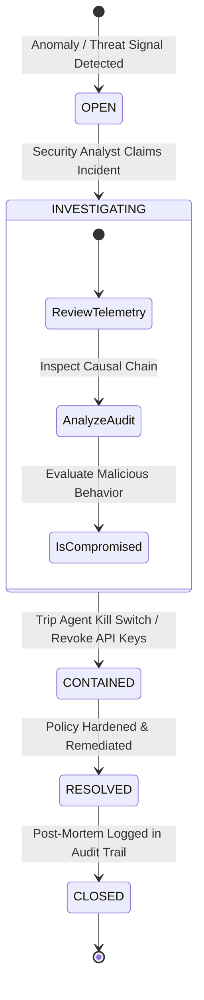

---

## 17. Internal Red Team Lab & Adversarial Fuzzing

The Red Team Lab tests policy resilience against simulated adversarial behavior without conducting destructive external attacks:

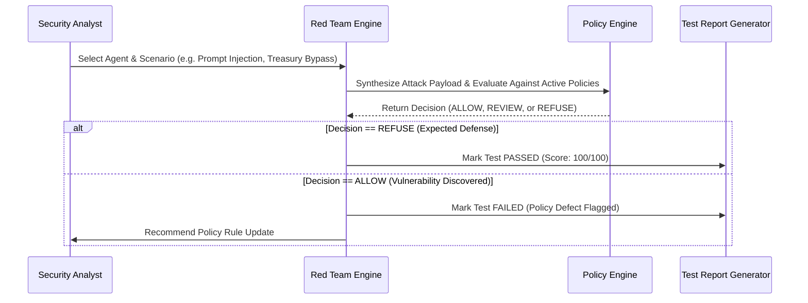

---

## 18. Digital Twin Sandboxed Stress Simulation

The Digital Twin evaluates what would happen under stress by projecting baseline historical telemetry into deterministic scenario simulations:

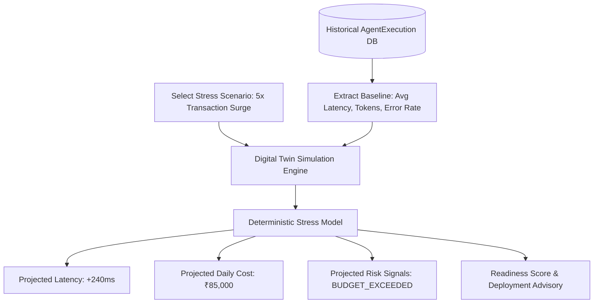

---

## 19. AI Model Governance & Dynamic Routing

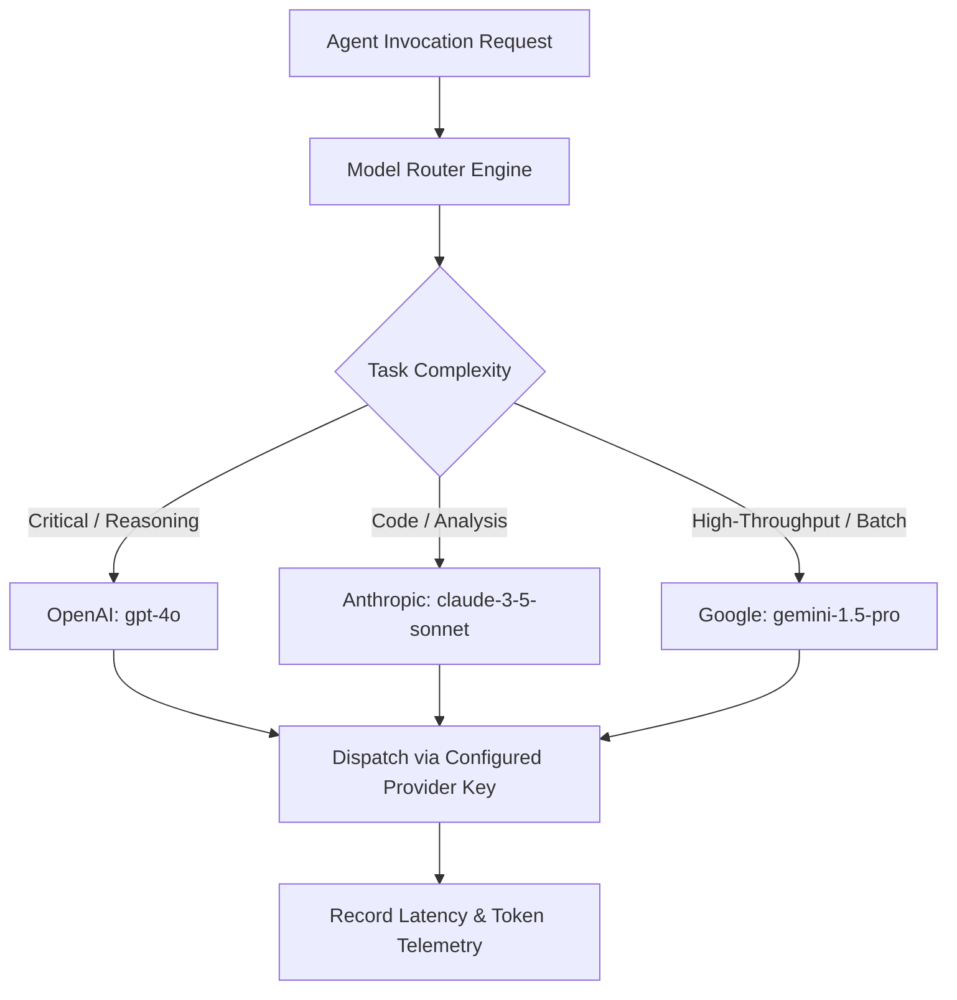

---

## 20. AI Output Governance & Guardrails

Before delivery to downstream consumers, agent-generated outputs pass through inspection guardrails:

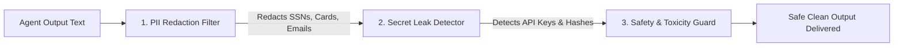

---

## 21. AI Admin Assistant Architecture

The AI Admin Assistant operates strictly within the authenticated user's organization scope:

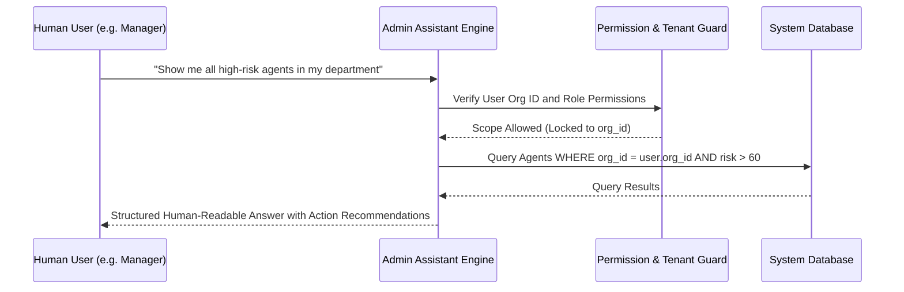

---

## 22. Notification & SSRF-Protected Webhook Infrastructure

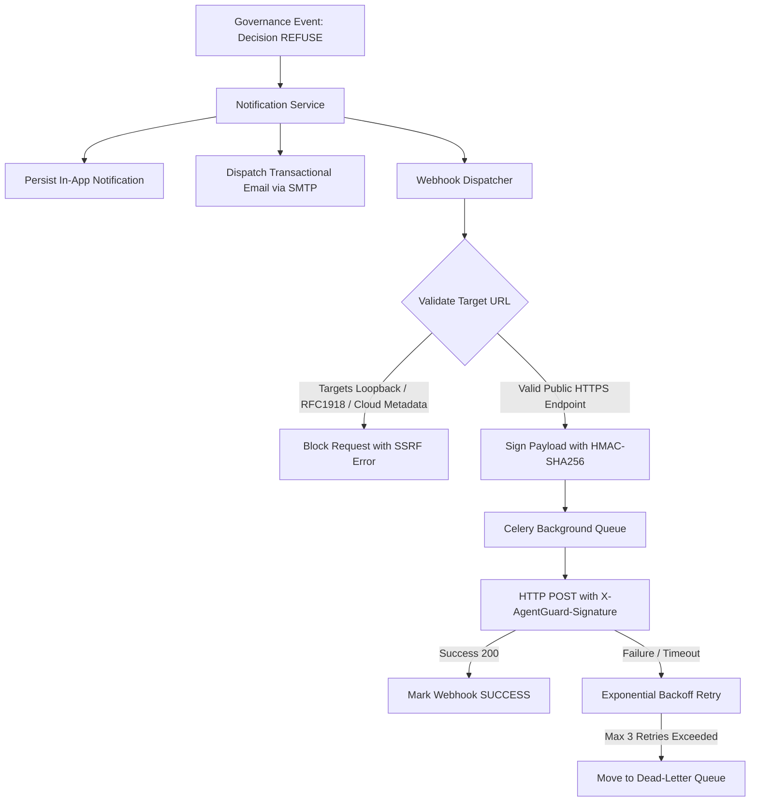

---

## 23. Background Workers, Celery Beat & Queue Topology

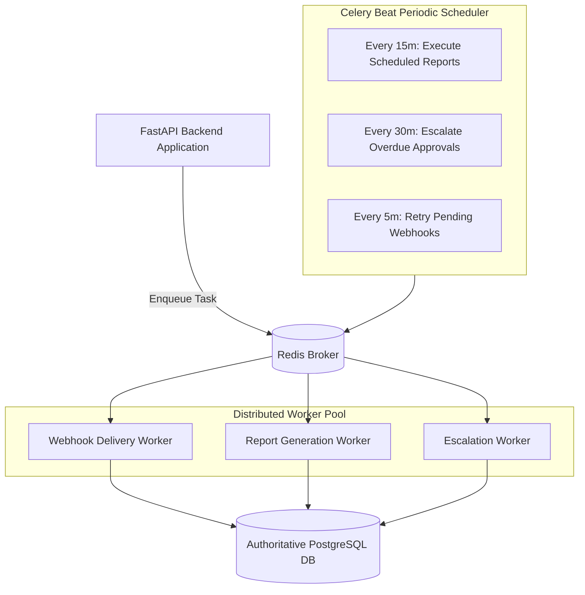

---

## 24. Enterprise Report Generation & Storage Abstraction

```mermaid
flowchart TD
    UserReq[Request: Generate Governance Report] --> ReportEngine[Report Center Engine]
    
    ReportEngine --> QueryData[Aggregate Tenant DB Records]
    QueryData --> FormatChoice{Select Format}
    
    FormatChoice -->|PDF| ReportLab[ReportLab Streaming PDF Renderer]
    FormatChoice -->|Excel| OpenPyXL[OpenPyXL Multi-Tab Styled Spreadsheet]
    FormatChoice -->|CSV| CSVEngine[Streaming CSV Writer]
    
    ReportLab & OpenPyXL & CSVEngine --> StorageRouter{Storage Provider}
    
    StorageRouter -->|LOCAL| LocalDir[Save to /storage/reports/{org_id}/]
    StorageRouter -->|S3| S3Bucket[Upload to s3://{bucket}/tenants/{org_id}/]
    
    StorageRouter --> History[(Record in ReportHistory DB)]
    History --> Download[Stream Binary to Client]
```

---

## 25. Multi-Tenant Subscription Billing & Quota Enforcement

```mermaid
graph TD
    Org[Tenant Organization] --> Lic[License Record]
    Lic --> Plan[Plan: FREE | STARTER | PROFESSIONAL | ENTERPRISE]
    
    Plan --> Quotas[Plan Hard Quotas]
    Quotas --> MaxUsers[Max Users Limit]
    Quotas --> MaxAgents[Max AI Agents Limit]
    Quotas --> MaxTokens[Monthly Request Cap]
    
    UserCreate[Create User Action] --> CheckUserQuota{Current Users >= Max?}
    CheckUserQuota -->|Yes| BlockUser[HTTP 402 Payment Required: Upgrade Plan]
    CheckUserQuota -->|No| AllowUser[Create User]

    AgentCreate[Create Agent Action] --> CheckAgentQuota{Current Agents >= Max?}
    CheckAgentQuota -->|Yes| BlockAgent[HTTP 402 Payment Required: Upgrade Plan]
    CheckAgentQuota -->|No| AllowAgent[Create Agent]
```

---

## 26. Super Admin Global Platform Operations

```mermaid
flowchart TD
    SA[Super Admin Identity] --> Dashboard[Super Admin Platform Dashboard]
    
    Dashboard --> OrgMgmt[Multi-Tenant Workspace Management]
    OrgMgmt --> ProvisionOrg[Provision New Organization]
    OrgMgmt --> SuspendOrg[Suspend / Deactivate Organization]
    OrgMgmt --> LicenseOrg[Upgrade / Extend Plan Licenses]
    
    Dashboard --> CrossAudit[Global Security & Audit Center]
    CrossAudit --> Impersonate[Set X-Organization-Context to Inspect Tenant]
    
    Dashboard --> SysHealth[Subsystem Health Diagnostics]
    SysHealth --> PingDB[Ping PostgreSQL Pool]
    SysHealth --> CheckRedis[Inspect Celery / Redis Broker]
    SysHealth --> CheckStorage[Verify S3 / Local Object Storage]
```

---

## 27. Actor Interaction Chronology: Who Interacts With What & When

| Sequence / Scenario | Initiating Actor | Target System / Component | Intermediary Checks | Resulting Output & Side Effects |
|---|---|---|---|---|
| **1. Tenant Setup** | `SUPER_ADMIN` | `POST /platform/organizations` | Global Super-Admin check | Provisions organization, seeds initial license, creates tenant admin. |
| **2. Admin Onboarding** | `ADMIN` | `POST /iam/invitations` | Tenant isolation, License user limit | Sends cryptographically hashed invite token via Email Service. |
| **3. Agent Provisioning** | `DEVELOPER` / `ADMIN` | `POST /agents` | License agent limit, Tenant binding | Generates unique agent code, signs passport, initializes budget & breaker. |
| **4. Policy Definition** | `ADMIN` / `MANAGER` | `POST /policies` | AST syntax validation | Stores active tenant governance policy rules with priorities. |
| **5. Action Request** | `AGENT` (Machine) | `POST /runtime/v1/intercept` | Machine Auth, Passport, Perms, Caps | Action evaluated through Risk & Policy Engine. |
| **6. High-Risk Escalation** | `SYSTEM` (Policy Engine)| `models.ApprovalRequest` | Output == REVIEW | Halts execution, dispatches WebSocket + email alerts to Managers. |
| **7. Approval Decision** | `MANAGER` | `POST /approvals/{id}/act` | Role check (`MANAGER`+), Tenant match | Updates status to `APPROVED`, signals Execution Gate to release tool call. |
| **8. Tool Dispatch** | `EXECUTION GATE` | Egress Tool Proxy | Pre-execution budget re-check | Dispatches tool call, records token telemetry and immutable audit log. |
| **9. Kill Switch Trigger** | `SECURITY_ANALYST` | `POST /agents/{id}/suspend` | Role check (`SECURITY_ANALYST`+) | Trips circuit breaker, revokes active capabilities, sets agent to SUSPENDED. |
| **10. Compliance Audit** | `ANALYST` | `POST /reports/generate` | Role check (`ANALYST`+) | Aggregates executions into styled PDF/Excel report stored with tenant isolation. |

---

## SUMMARY ARCHITECTURAL PRINCIPLE

```text
       AGENT ACTION
            │
            ▼
┌────────────────────────┐
│       AGENTGUARD       │
│  Control Plane Kernel  │
├────────────────────────┤
│ 1. Machine Auth        │
│ 2. Tenant Isolation    │
│ 3. Passport Validation │
│ 4. Permission Check    │
│ 5. Capability Token    │
│ 6. Intent & Context    │
│ 7. Risk Engine         │
│ 8. Circuit Breaker     │
│ 9. Policy Evaluation   │
└───────────┬────────────┘
            │
    ┌───────┴───────┐
    ▼               ▼
  ALLOW           REFUSE
    │               │
    ▼               ▼
 Tool Execution   Block & Alert
    │               │
    └───────┬───────┘
            ▼
    Telemetry + FinOps
            ▼
    Immutable Audit Log
```

> **Every future implementation phase in AGENTGUARD must trace its inputs and outputs directly against this master reference model.**
