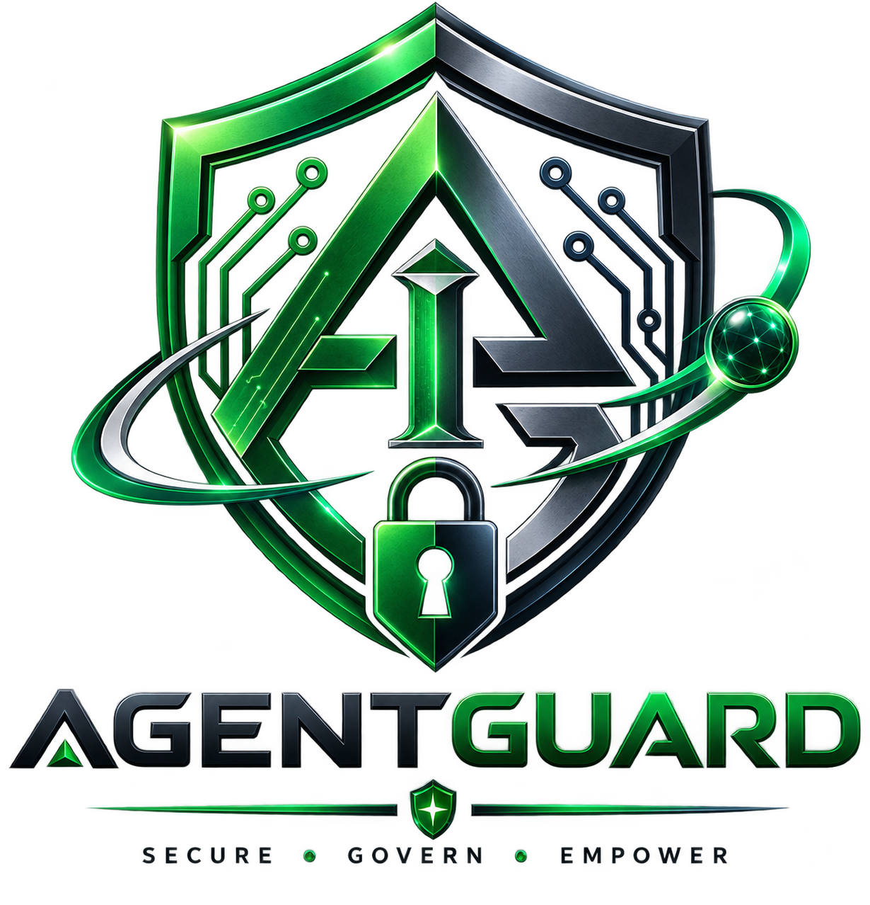

# AGENTGUARD — Runtime Control Plane for Autonomous AI

<p align="center">
  
</p>

> **Tagline**: Runtime Control Plane for Autonomous AI

AGENTGUARD is an enterprise AI governance and runtime security platform designed to manage, monitor, and enforce zero-trust policies on autonomous AI employees.

---

## 🏗️ Architecture & Core Governance Pipeline

```
Human / AI Request
       │
       ▼
AI Intent Engine
       │
       ▼
Agent Identity & Passport Verification
       │
       ▼
Permission Matrix Verification
       │
       ▼
Dynamic Capability Token System (Task-Specific Authority)
       │
       ▼
Governance Policy Engine Evaluation
       │
       ▼
Risk Engine Scoring (0 - 100)
       │
       ▼
Right-to-Refuse Engine Decision (ALLOW / REVIEW / REFUSE)
       ├── ALLOW  ──► Execution Engine ──► Behavioral Fingerprinting ──► Audit & Provenance
       ├── REVIEW ──► Human Approval Queue ──► Managerial Review
       └── REFUSE ──► Action Blocked & Security Incident Logged
```

---

## 📁 Repository Structure

```
AGENTGUARD/
├── frontend/             # Next.js 14, React, Tailwind CSS, Supabase Auth
│   ├── public/           # Logo & static brand assets (logo.png)
│   ├── src/
│   │   ├── app/          # Next.js App Router pages & protected routes
│   │   ├── components/   # UI components
│   │   ├── lib/          # API & Supabase browser client helpers
│   │   └── middleware.ts # Route authentication guard
│   ├── .env.local        # Browser-safe public Supabase environment variables
│   └── package.json
│
├── backend/              # Python FastAPI, SQLAlchemy, Engines, WebSockets
│   ├── core/             # Security, auth dependencies
│   ├── engines/          # Governance, Risk, Policy, Provenance engines
│   ├── models/           # Database models (User, Agent, Policy, Decision, etc.)
│   ├── routers/          # API domain routers
│   ├── tests/            # Automated verification test suite
│   ├── config.py         # App configuration
│   ├── database.py       # PostgreSQL / SQLAlchemy connection engine
│   ├── main.py           # FastAPI entrypoint & WebSocket endpoint
│   ├── seed.py           # Schema initialization script
│   └── requirements.txt  # Dependencies
│
├── supabase/
│   └── migrations/       # PostgreSQL schema & RLS policies
│
├── logo.png
├── README.md
└── .gitignore
```

---

## 🚀 How to Run Locally

### 1. Start Python Backend API (FastAPI)
```bash
cd backend
pip install -r requirements.txt
python seed.py        # Initializes database schema
uvicorn main:app --reload --port 8000
```
- API Base URL: `http://localhost:8000/api`
- Interactive Swagger Docs: `http://localhost:8000/docs`
- WebSocket Server: `ws://localhost:8000/ws`

### 2. Start Next.js Frontend
```bash
cd frontend
npm install
npm run dev
```
- Frontend Application: `http://localhost:3000`

---

## 🔐 Authentication & Database

- **Database**: Supabase PostgreSQL (via `DATABASE_URL` in `backend/.env`).
- **Auth**: Supabase Auth (`supabase.auth.signUp()`, `signInWithPassword()`, `signInWithOtp()`, `verifyOtp()`).
- **Data Source**: 100% database-driven. Zero hardcoded/mock demo records.
