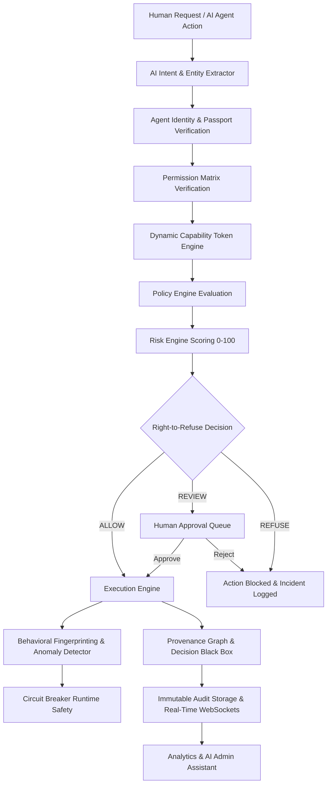
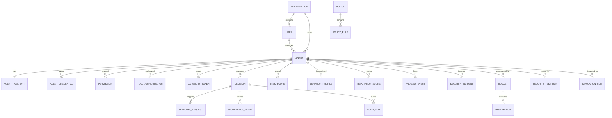

# AGENTGUARD Implementation Plan: Runtime Control Plane for Autonomous AI

## Architectural Overview

**AGENTGUARD** is an enterprise AI governance and runtime security platform. The architecture enforces an immutable zero-trust control loop for autonomous AI agents:



---

## 🎨 UI Design System Specification

| Token | Hex / Value | Description |
| :--- | :--- | :--- |
| **Primary Font** | `"Times New Roman", Times, serif` | Used globally for all text, headings, buttons, tables, cards |
| **Page Background** | `#FCFCFA` | Off-white premium soft background |
| **Card Background** | `#FFFFFF` | White card background |
| **Border Color** | `#E8E8E4` | Soft subtle border |
| **Primary Text** | `#1F1F1F` | Dark charcoal text |
| **Secondary Text** | `#666666` | Medium gray descriptive text |
| **Primary Green** | `#2E9D50` | Active, Allowed, Healthy, Primary Actions |
| **Light Green** | `#EAF7EE` | Green KPI card background, active badge BG |
| **Warning Orange** | `#F59A23` | Warning, Review Required, Pending, Attention |
| **Soft Yellow** | `#FFF4D9` | Warning card BG, pending badge BG |
| **Primary Red** | `#E53935` | Refused, Critical, Security Incident, Suspended |
| **Light Red** | `#FDECEC` | Danger BG, refusal card BG |
| **Primary Blue** | `#2878D4` | Information, APIs, Technical Info |
| **Light Blue** | `#EAF3FC` | Info card BG |
| **AI Purple** | `#8064C8` | AI Assistant, Intent Engine, Model Router |
| **Light Purple** | `#F1EDFA` | AI card BG, purple badge BG |
| **Card Radius** | `14px` | Standard rounded corner for UI cards |
| **Button Radius** | `8px` | Radius for buttons and inputs |

---

## 🗄️ Database Schema Design (32+ Core Entities)



### Table Definitions
1. **organizations**: `id`, `name`, `domain`, `created_at`
2. **users**: `id`, `org_id`, `email`, `password_hash`, `full_name`, `role` (ADMIN, MANAGER, SECURITY_OFFICER, AUDITOR, AGENT), `department`, `status`, `created_at`
3. **sessions**: `id`, `user_id`, `token`, `refresh_token`, `ip_address`, `user_agent`, `expires_at`, `revoked`
4. **agents**: `id`, `org_id`, `owner_id`, `name`, `department`, `purpose`, `model_name`, `model_version`, `environment`, `autonomy_level` (LOW, MEDIUM, HIGH, FULL), `status` (NORMAL, WARNING, RESTRICTED, HUMAN_APPROVAL, CIRCUIT_BREAK, SUSPENDED), `risk_score`, `trust_score`, `daily_budget`, `created_at`, `expires_at`
5. **agent_passports**: `id`, `agent_id`, `passport_number`, `digital_signature`, `issued_at`, `expires_at`, `verification_status`
6. **agent_credentials**: `id`, `agent_id`, `credential_type`, `key_hash`, `status`, `created_at`, `expires_at`
7. **permissions**: `id`, `agent_id`, `resource_type`, `resource_name`, `action` (READ, WRITE, CREATE, UPDATE, DELETE, EXECUTE, APPROVE, EXPORT, ADMIN), `is_allowed`, `created_at`
8. **tools**: `id`, `name`, `category`, `endpoint`, `risk_level`, `status`, `latency_ms`
9. **tool_authorizations**: `id`, `agent_id`, `tool_id`, `max_daily_calls`, `status`
10. **capabilities**: `id`, `name`, `resource`, `action`, `default_ttl_seconds`, `max_amount`
11. **capability_tokens**: `id`, `agent_id`, `capability_id`, `token_hash`, `scope`, `amount_limit`, `issued_at`, `expires_at`, `status` (ACTIVE, EXPIRED, REVOKED, USED)
12. **policies**: `id`, `org_id`, `name`, `category` (DATA, FINANCE, SECURITY, PRIVACY, TOOLS, AUTONOMY, AGENT_TO_AGENT, RESOURCE), `priority`, `status`, `version`
13. **policy_rules**: `id`, `policy_id`, `condition_json`, `decision_output` (ALLOW, REVIEW, REFUSE), `risk_delta`
14. **decisions**: `id`, `agent_id`, `user_id`, `intent_summary`, `action_requested`, `resource_target`, `amount`, `decision` (ALLOW, REVIEW, REFUSE), `risk_score`, `policy_id`, `explanation`, `execution_status`, `timestamp`
15. **approval_requests**: `id`, `decision_id`, `agent_id`, `approver_id`, `amount`, `reason`, `status` (PENDING, APPROVED, REJECTED, EXPIRED), `created_at`, `resolved_at`
16. **risk_scores**: `id`, `agent_id`, `overall_score`, `identity_risk`, `permission_risk`, `behavior_risk`, `financial_risk`, `data_sensitivity_risk`, `timestamp`
17. **behavior_profiles**: `id`, `agent_id`, `avg_daily_actions`, `normal_operating_hours`, `allowed_tools_json`, `baseline_spending`, `updated_at`
18. **reputation_scores**: `id`, `agent_id`, `trust_score`, `successful_tasks`, `violations_count`, `anomalies_count`, `overrides_count`
19. **anomaly_events**: `id`, `agent_id`, `anomaly_type`, `severity` (LOW, MEDIUM, HIGH, CRITICAL), `description`, `deviation_score`, `timestamp`
20. **security_incidents**: `id`, `org_id`, `agent_id`, `title`, `severity`, `status` (OPEN, INVESTIGATING, CONTAINED, RESOLVED), `timeline_json`, `created_at`
21. **circuit_breakers**: `id`, `agent_id`, `state` (NORMAL, WARNING, RESTRICTED, HUMAN_APPROVAL, CIRCUIT_BREAK, SUSPENDED), `trigger_reason`, `tripped_at`, `restored_at`
22. **provenance_events**: `id`, `decision_id`, `human_initiator_id`, `agent_id`, `delegated_agent_id`, `tool_used_id`, `data_accessed`, `causal_chain_json`, `timestamp`
23. **audit_logs**: `id`, `event_type`, `actor_type` (HUMAN, AGENT, SYSTEM), `actor_id`, `action`, `resource`, `result`, `metadata_json`, `timestamp`
24. **agent_relationships**: `id`, `parent_agent_id`, `child_agent_id`, `trust_status`, `allowed_delegation_types`
25. **api_keys**: `id`, `org_id`, `name`, `key_prefix`, `key_hash`, `scopes`, `created_at`, `expires_at`
26. **ai_models**: `id`, `model_name`, `provider`, `cost_per_1k_tokens`, `avg_latency_ms`, `accuracy_rating`, `status`
27. **budgets**: `id`, `agent_id`, `daily_limit`, `monthly_limit`, `current_daily_spend`, `current_monthly_spend`, `currency`
28. **transactions**: `id`, `agent_id`, `amount`, `vendor`, `currency`, `status` (APPROVED, REJECTED, PENDING), `timestamp`
29. **security_tests**: `id`, `agent_id`, `test_type` (PROMPT_INJECTION, GOAL_HIJACKING, PRIVILEGE_ESCALATION, TOOL_ABUSE, DATA_EXFILTRATION, EXCESSIVE_SPENDING), `attack_payload`, `defense_result` (PASSED, FAILED, MITIGATED), `security_score`, `timestamp`
30. **simulations**: `id`, `agent_id`, `scenario_type` (TRAFFIC_SPIKE, API_FAILURE, MALICIOUS_DATA, PERMISSION_REVOCATION), `readiness_score`, `metrics_json`, `timestamp`
31. **resource_usages**: `id`, `agent_id`, `cpu_pct`, `gpu_pct`, `memory_mb`, `compute_cost`, `timestamp`
32. **notifications**: `id`, `user_id`, `type`, `title`, `message`, `severity`, `is_read`, `created_at`

---

## 📂 System File Architecture

```
AGENTGUARD/
├── apps/
│   ├── web/                     # Next.js 14 Frontend
│   │   ├── src/
│   │   │   ├── app/             # App Router Pages & Components
│   │   │   │   ├── layout.tsx   # Global Shell (Times New Roman, Left Sidebar, Top Nav)
│   │   │   │   ├── page.tsx     # Executive Dashboard (/dashboard)
│   │   │   │   ├── login/       # Auth Pages
│   │   │   │   ├── agents/      # Agent Management, Passports, Network, Twins
│   │   │   │   ├── iam/         # Identity, Users, Roles, API Keys, Sessions
│   │   │   │   ├── permissions/ # Granular Permission Matrix & Templates
│   │   │   │   ├── capabilities/# Dynamic Capability Token System
│   │   │   │   ├── policies/    # Policy Engine, Rules, Simulator
│   │   │   │   ├── ai/          # AI Command Center, Intent Analysis, Models
│   │   │   │   ├── decisions/   # Decision Black Box & Right-to-Refuse
│   │   │   │   ├── risk/        # Risk Management & Escalation
│   │   │   │   ├── trust/       # Continuous Trust & Reputation
│   │   │   │   ├── behavior/    # Behavioral Fingerprinting & Profiles
│   │   │   │   ├── security/    # Security Operations Center & Incidents
│   │   │   │   ├── runtime/     # Circuit Breaker & Emergency Kill Switch
│   │   │   │   ├── activity/    # Live Real-Time WebSocket Activity Feed
│   │   │   │   ├── approvals/   # Human-in-the-Loop Approval Queue
│   │   │   │   ├── provenance/  # Interactive Provenance Graph
│   │   │   │   ├── audit/       # Global Immutable Audit Logs
│   │   │   │   ├── red-team/    # AgentGuard Red-Team Lab
│   │   │   │   ├── digital-twin/# Agent Digital Twin Simulation
│   │   │   │   ├── economics/   # Financial Budgets & Guardrails
│   │   │   │   ├── impact/      # Responsible AI Impact Assessment
│   │   │   │   ├── optimization/# Model & Compute Resource Router
│   │   │   │   ├── analytics/   # Analytics & Intelligence
│   │   │   │   ├── assistant/   # AI Admin Assistant Chat Console
│   │   │   │   ├── developers/  # API Platform & Explorer
│   │   │   │   ├── integrations/# Integrations Hub
│   │   │   │   ├── system/      # System Health & Services
│   │   │   │   ├── settings/    # Enterprise Platform Settings
│   │   │   │   └── notifications/# Notification Center
│   │   │   ├── components/      # UI Design System Components
│   │   │   │   ├── ui/          # Buttons, Cards, Badges, Modals, Inputs
│   │   │   │   ├── layout/      # Sidebar, TopNav, Header, Footer
│   │   │   │   └── modules/     # Feature-specific complex widgets (Passport Card, Graphs)
│   │   │   └── lib/             # API client, WebSocket hooks, design tokens
│   └── api/                     # Python FastAPI Backend Architecture
│       ├── main.py              # FastAPI Application Entrypoint
│       ├── database.py          # SQLAlchemy Session & DB connection
│       ├── models/              # SQLAlchemy Models (32+ Entities)
│       ├── schemas/             # Pydantic Request/Response Schemas
│       ├── core/                # Config, Security, JWT, Event Bus
│       ├── engines/             # Core Governance Engines
│       │   ├── intent_engine.py      # AI Intent & Entity Extractor
│       │   ├── policy_engine.py      # Policy Evaluator (ALLOW / REVIEW / REFUSE)
│       │   ├── risk_engine.py        # Risk Scoring Algorithm (0-100)
│       │   ├── capability_engine.py  # Task-specific Capability Tokens
│       │   ├── behavior_engine.py    # Fingerprinting & Anomaly Detection
│       │   ├── circuit_breaker.py   # Runtime Safety & Suspension Trigger
│       │   ├── provenance_engine.py  # Causal Chain Recorder
│       │   ├── red_team_engine.py    # Security Testing Runner
│       │   ├── digital_twin_engine.py# Simulation & Readiness Evaluator
│       │   ├── model_router.py       # Compute & Model Selection
│       │   └── assistant_engine.py   # Natural-Language Data Assistant
│       ├── routers/             # API Endpoint Controllers (Rest APIs)
│       ├── websockets/          # Real-time WebSocket connection manager & broadcast
│       └── seed/                # Seed script with populated demo enterprise data
```

---

## 🗺️ Complete Page Map Checklist

- [x] **0. Auth**: `/login`, `/register`, `/forgot-password`, `/reset-password`, `/mfa`, `/sessions`
- [x] **1. Dashboard**: `/dashboard` (Executive KPI Cards, Activity Graphs, Risk Trends, Decision Distribution)
- [x] **2. Agent Management**: `/agents`, `/agents/create`, `/agents/[id]`, `/agents/[id]/edit`, `/agents/[id]/passport`, `/agents/[id]/permissions`, `/agents/[id]/tools`, `/agents/[id]/credentials`, `/agents/[id]/activity`, `/agents/[id]/risk`, `/agents/[id]/reputation`, `/agents/[id]/behavior`, `/agents/[id]/history`
- [x] **3. Agent Passport**: `/agents/[id]/passport` (Visual identity passport with QR, verification status, capability digest)
- [x] **4. Identity & IAM**: `/iam`, `/iam/users`, `/iam/roles`, `/iam/agents`, `/iam/credentials`, `/iam/api-keys`, `/iam/sessions`, `/iam/access-history`
- [x] **5. Permission Management**: `/permissions`, `/permissions/matrix`, `/permissions/templates`, `/permissions/history`
- [x] **6. Capability Management**: `/capabilities`, `/capabilities/tokens`, `/capabilities/active`, `/capabilities/requests`, `/capabilities/policies`, `/capabilities/[id]`
- [x] **7. Policy Center**: `/policies`, `/policies/all`, `/policies/create`, `/policies/[id]`, `/policies/[id]/edit`, `/policies/simulator`, `/policies/violations`
- [x] **8. AI Command Center**: `/ai`, `/ai/command`, `/ai/intents`, `/ai/decisions`, `/ai/models`, `/ai/prompts`, `/ai/assistant`
- [x] **9. Decision Engine**: `/decisions`, `/decisions/[id]`, `/decisions/allow`, `/decisions/review`, `/decisions/refuse`, `/decisions/black-box`
- [x] **10. Risk Management**: `/risk`, `/risk/agents`, `/risk/events`, `/risk/trends`, `/risk/rules`, `/risk/settings`
- [x] **11. Reputation / Trust**: `/trust`, `/trust/reputation`, `/trust/history`, `/trust/low-trust`
- [x] **12. Behavior Analytics**: `/behavior`, `/behavior/profiles`, `/behavior/deviations`, `/behavior/timeline`
- [x] **13. Security Center**: `/security`, `/security/threats`, `/security/events`, `/security/incidents`, `/security/incidents/[id]`, `/security/alerts`
- [x] **14. Circuit Breaker**: `/runtime`, `/runtime/circuit-breakers`, `/runtime/suspended`, `/runtime/kill-switch`
- [x] **15. Live Activity**: `/activity` (WebSocket real-time live event streaming feed)
- [x] **16. Human Approval Center**: `/approvals`, `/approvals/pending`, `/approvals/[id]`
- [x] **17. Agent Network & Trust**: `/agent-network`, `/agent-network/trust`, `/agent-network/delegations`
- [x] **18. Provenance Graph**: `/provenance`, `/provenance/[id]` (Visual causal tree representation)
- [x] **19. Audit Center**: `/audit`, `/audit/logs`, `/audit/decisions`, `/audit/export`
- [x] **20. Red-Team Lab**: `/red-team`, `/red-team/create`, `/red-team/scenarios`, `/red-team/runs`, `/red-team/vulnerabilities`
- [x] **21. Digital Twin**: `/digital-twin`, `/digital-twin/create`, `/digital-twin/simulations`, `/digital-twin/[id]`
- [x] **22. Economics**: `/economics`, `/economics/budgets`, `/economics/transactions`, `/economics/spending`
- [x] **23. Responsible AI**: `/impact`, `/impact/assessments`, `/impact/high-impact`
- [x] **24. Optimization**: `/optimization`, `/optimization/models`, `/optimization/compute`
- [x] **25. Analytics**: `/analytics`, `/analytics/agents`, `/analytics/security`, `/analytics/risk`, `/analytics/finance`
- [x] **26. AI Admin Assistant**: `/assistant` (Interactive natural-language query console)
- [x] **27. Developer Portal**: `/developers`, `/developers/api-keys`, `/developers/docs`, `/developers/explorer`
- [x] **28. Integrations**: `/integrations`
- [x] **29. System Monitoring**: `/system`, `/system/health`, `/system/services`
- [x] **30. Enterprise Settings**: `/settings`
- [x] **31. Notifications**: `/notifications`
- [x] **32. Global Search**: `/search`

---

## ⚡ Key Implementation Modules & Feature Engines

### 1. Dynamic Capability Token Engine
- Issue dynamic short-lived JWT/HMAC tokens for exact task execution (e.g. `action=refund:create`, `customer=9281`, `max_amount=5000`, `ttl=60s`).
- Require and validate capability tokens before tool execution. Automatically expire and log usage.

### 2. Governance & Policy Engine (Right-to-Refuse)
- Enforce strict 6-stage check: `Identity -> Permission -> Capability -> Context -> Risk -> Policy`.
- Decision outputs: `ALLOW` (Green #2E9D50), `REVIEW` (Orange #F59A23), `REFUSE` (Red #E53935).
- Auto-generate detailed natural-language & structured explanations for every decision.

### 3. Risk & Behavioral Engine
- Dynamic scoring algorithm (0-100) combining identity risk, permission scope, action amount, time of day, and historical behavior deviation.
- Calculate continuous Agent Trust/Reputation score separately from immediate risk.

### 4. Circuit Breaker Runtime Safety
- Agent state state machine: `NORMAL -> WARNING -> RESTRICTED -> HUMAN_APPROVAL -> CIRCUIT_BREAK -> SUSPENDED`.
- One-click Emergency Kill Switch to revoke capability tokens, invalidate credentials, and suspend rogue agents instantly.

### 5. Red-Team Lab & Digital Twin Simulation
- Red-Team Lab: Execute automated security test scenarios against agents (Prompt Injection, Goal Hijacking, Privilege Escalation, Tool Abuse, Exfiltration) and calculate Security Score.
- Digital Twin: Simulate 10x traffic, API failures, and malicious data payloads to return a Deployment Readiness Score (0-100).

### 6. Natural Language AI Intent & Assistant
- Intent Extractor: Parse prompt like `"Refund ₹48,000 to customer 9281"` into structured action payload.
- AI Admin Assistant: Query live system DB for queries like `"Which agents are suspicious?"` or `"Why was AG-184 blocked?"` with data-driven answers.

---

## 🔄 End-to-End Demo Scenario Implementation

**Scenario**: User inputs `"Refund ₹48,000 to customer 9281"`.
1. **AI Intent Engine**: Extracts intent=`REFUND`, customer_id=`9281`, amount=`48000`, target_agent=`AG-184 (RefundAgent)`.
2. **Identity & Auth**: Validates `AG-184` status (`NORMAL`), owner (`Finance Dept`), passport validity.
3. **Permission Check**: Verifies `AG-184` has `WRITE` permission on `Refunds`.
4. **Capability Token Request**: Requests capability `refund:create` for `₹48,000`.
5. **Policy Engine**: Checks financial rule: max automatic limit is `₹5,000`.
6. **Risk Engine**: Calculates risk score: `78 / 100 (HIGH)` due to large amount exceeding ₹5,000 threshold.
7. **Governance Decision**: Triggers `RIGHT-TO-REFUSE / REVIEW REQUIRED`. Output: `REVIEW`.
8. **Human-in-the-Loop**: Generates approval request `APP-9281` assigned to `Finance Manager`.
9. **Live Monitoring**: Emits WebSocket event displaying real-time alert on `/activity` and `/dashboard`.
10. **Decision Black Box & Provenance**: Records full causal chain `Human -> Intent -> AG-184 -> Policy Check -> Decision (REVIEW)` in persistent audit logs.

---

## 🛠️ Verification & Quality Assurance Plan

### Automated Verification
1. **Backend Verification**:
   - Run Python pytest / FastAPI endpoint test suite verifying REST API routes for authentication, agent creation, capability tokens, policy evaluation, risk scoring, decision black box, red-team lab, and AI assistant.
   - Verify database migrations and seed script execution.
2. **Frontend Verification**:
   - Run `npm run build` in Next.js to ensure 0 TypeScript or React compilation errors.
   - Test UI responsiveness and design token compliance (Times New Roman font, palette colors `#2E9D50`, `#FCFCFA`, `#E8E8E4`, etc.).

### Manual Verification
1. Execute the complete **End-to-End Demo Scenario** through the UI and verify backend state changes, WebSocket feed updates, and decision explanations.
2. Test agent suspension kill switch and confirm instant capability token revocation.
3. Run a Red-Team attack simulation and verify vulnerability detection reports.
